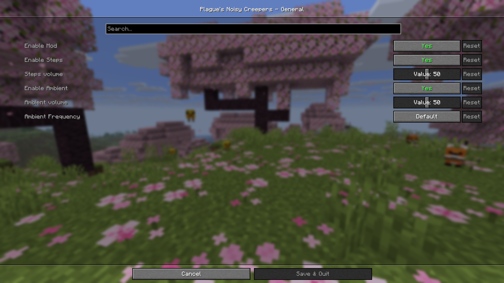

# Plague's Noisy Creepers

[][fabric]

A client-side Fabric mod that adds footstep and idle sounds to creepers!

## 📖 What is this mod?

This is a client-side mod made for [Fabric modloader][fabric] that allows users to add footstep and idle sounds to creepers.

Have you ever been caught off guard by a creeper on a mining trip and thought that creepers were just a little too good at sneaking?
With this mod, creepers will have a harder time creeping up on you!
The Noisy Creepers mod adds footstep and idle sounds to creepers, making them a little less stealthy and a little easier to notice.

The volume and frequency of the sounds can be customized, so you can make the creepers as noticeable, or as sneaky as you want them to be.

Here is a little showcase!

<video src="showcase/NoisyCreepers.mp4" controls = "controls" style="max-width:100%"></video>

## ✅ Features

- Add footstep sounds to creepers
    - Configure footstep volume
- Add idle sounds to creepers
    - Configure idle sound volume
    - Configure idle sound frequency
    
## 📖 Usage

Using this mod is very simple!

Put the jar file in your mods folder; you also need to put the [Fabric API] jar file in your mods folder, and you are good to go!

If you wish to be able to access the settings of the mod within the game; you will also need to put [ModMenu] and [Cloth Config API] in your mods folder.
You can also edit the configuration file found in config folder manually if you wish to do so.

## 📖 Compatibility

This mod should be compatible with almost every mod, as it only adds client-side sounds to creepers.

## 🌐 Multiplayer Servers

This mod is entirely client-side and does not require installation on the server. It should work on virtually any multiplayer server, provided that the server allows Fabric clients to join.

However, because the mod makes creepers easier to hear and therefore easier to detect, some players or server communities may consider it  to provide a gameplay advantage. While the mod does not modify gameplay mechanics, entity behavior, or network traffic, it maybe viewed similarly to accessibility or awareness enhancing mods.

If you're unsure whether this mod is allowed on a server, it is recommended that you check the server rules or ask the server staff before using it.

[fabric]: https://fabricmc.net
[Fabric API]: https://modrinth.com/mod/fabric-api "Fabric API Modrinth page"
[ModMenu]: https://modrinth.com/mod/modmenu "ModMenu Modrinth page"
[Cloth Config API]: https://modrinth.com/mod/cloth-config "Cloth Config API Modrinth page"